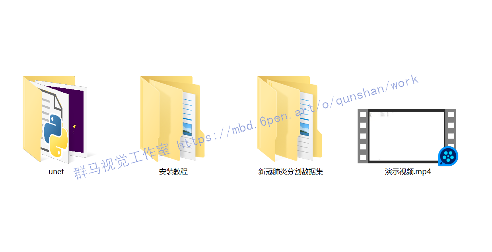

# 1.研究背景

新冠肺炎给人类带来极大威胁,自动精确分割新冠肺炎CT图像感染区域可以辅助医生进行诊断治疗,但新冠肺炎的弥漫性感染、感染区域形状多变、与其他肺部组织极易混淆等给CT图像分割带来挑战。为此,提出新冠肺炎肺部CT图像分割新模型XR-MSF-Unet,采用XR卷积模块代替U-Net的两层卷积,XR各分支的不同卷积核使模型能够提取更多有用特征;提出即插即用的融合多尺度特征的注意力模块MSF ,融合不同感受野、全局、局部和空间特征,强化网络的细节分割效果。在COVID-19 CT公开数据集的实验表明:提出的XR模块能够增强模型的特征提取能力,提出的MSF模块结合XR模块,能够有效提高模型对新冠肺炎感染区域的分割效果;提出的XR-MSF-Unet模型取得了很好的分割效果,其Dice,IOU 、F1-Score和Sensitivity指标分别比基模型U-Net的相应指标高出3.21、5.96,1.22和4.83个百分点,且优于同类模型的分割效果,实现了新冠肺炎肺部CT图像的自动有效分割。

# 2.图片演示


# 3.视频演示
[Python基于改进Unet的新冠肺炎等级分割系统（源码＆教程）_哔哩哔哩_bilibili](https://www.bilibili.com/video/BV1Tg411m727/?vd_source=bc9aec86d164b67a7004b996143742dc)


# 4.U-Net网络简介
传统语义分割采用基于颜色、形状等低级语义信息P,无法很好分割复杂图像。深度学习技术使用高级语义信息进行分割。2015年,Long等人P3首次使用全卷积神经网络对自然图像进行端到端分割,实现了从传统方法到深度学习方法的突破。2015年Ronneberger等人"在全卷积神经网络基础上提出U-Net结构,在ISBI细胞分割挑战赛中获得第一名。U-Net网络包含编码和解码两部分,编码器进行下采样操作,提取原始图像空间特征,解码器进行上采样操作,根据编码器所提取的空间特征构造出图像。为了防止对应特征丢失,对应编码器和解码器之间有跳跃连接。U-Net的编码器采用两层3x3卷积、ReLU激活函数和2×2最大池化,来提取图像特征,共进行4次下采样,该过程降低特征图尺寸,增加通道数,最终通道数为原来的16倍。解码器部分使用2×2反卷积进行上采样,减少通道数,逐渐恢复特征图尺寸。然而,新冠肺炎CT图像十分复杂,U-Net在编码器每一个阶段仅使用普通的两层卷积和池化操作来提取特征,相较于经过设计的卷积组合,这样的特征提取方式容易导致模型无法提取到全部有用的特征信息,甚至还会有一部分特征在这个过程中丢失。此外,U-Net的解码器在逐步恢复图像时也采用简单的两层卷积和反卷积进行,这样又会导致一定的特征信息损失,最终使得网络无法完全恢复图像的复杂特征信息。另外,U-Net没有考虑全局、局部和不同空间位置的特征差异。为了提取新冠肺炎CT图像的复杂特征,提升对该类CT图像感染区域分割的准确性,本文将对U-Net的特征提取结构进行改进。

# 5.多尺度特征融合注意力模块 MSF

新冠肺炎感染区域大多为弥漫性感染,整幅图像中各个角落都可能存在感染区。卷积感受野大小决定特征关注区域大小,感受野过大或过小可能会使CT图像部分感染区域被分割错误。另外,新冠肺炎感染区域位置不定,形状复杂,极易与其他肺部结构混淆,因此,为使模型能发现感染区域并增加其发现感染区域的能力,提出如图所示的融合多尺度特征的即插即用注意力模块MSF(multi-scale features fusionmodule)。


为了避免感受野不同给模型特征提取带来的问题,MSF模块使用3×3、5×5和7×7三种不同大小感受野的卷积核以并行的方式提取特征,这三种不同大小的卷积核分别具有小、中、大三种不同大小的感受野,提取的特征分别经过批归一化BN和ReLU激活后进行特征融合,这样并行的特征提取策略可以最大程度地减少串行卷积带来的特征损失,可以保证融合后的特征图中尽可能多地包含图像的各种特征信息。之后,融合的特征分别经过全局注意力模块(global attention module, GAM)和空间注意力模块(spatial attention module, SAM)构成的一个分支以及局部注意力模块(local attention module ,LAM)和空间注意力模块SAM构成的另一个分支,最后将两支注意力模块特征加和,实现不同大小感受野、全局、局部和不同空间特征的融合,使最终输出的特征图包含不同尺度和位置的信息,从各种维度最大限度保证模型提取到图像更多的特征信息。
假设输入通道数、高、宽分别为C、H和W的特征图F=RC×H*W,图3融合不同大小感受野的特征F'可表达为式(1)。其中,Conv"差XI”表示大小为m×m 、步长为stride的卷积。特征F′分别经过全局注意力模块GAM和局部注意力模块LAM,得到式(2)和式(3)的特征F。和F，。特征F。和F,分别经过空间注意力模块SAM融合位置信息,然后对应分量加和得到式(4)融合不同感受野、关注全局、局部细节信息以及空间位置的新特征图NF.


# 6.新冠肺炎分割数据集（2937张专业标注＆文末附下载链接）
使用[该博客分享的包含约60名新冠肺炎患者的共100张轴向CT图像和放射科医生对这100张CT图像感染区域的标注图像](https://afdian.net/item?plan_id=3ce35eae5c0a11edb3ab52540025c377)。COVID-19-2数据集由Radio-paedia 的9个不同病例的共829张轴向二维CT切片组成,其中有373张为新冠肺炎切片,由放射科医生进行了感染区域的分割标注,原始数据格式为NIFTI。COVID-19-3数据集由Coronacases Initiative和 Radiopaedia的20个不同病例的共1844张新冠肺炎CT切片组成,感染区域由有经验的放射科医生进行标注。COVID-19-4数据集来源于俄罗斯莫斯科市立医院,包含2937个病例的肺部CT图像,本文使用的为来自其中50个病例的有专家标注图像感染区域的785张确诊新冠肺炎CT图像。


# 7. MSF模块的特征加和权重测试和训练结果
[参考该博客提出的MSF模块](https://mbd.pub/o/bread/Y5iUm5hr)对经过SAM模块的融合全局与空间信息的特征图FC。和融合局部信息与空间信息的特征图Fs的对应元素相加得到融合特征。为了确定Fc和Fs这两个特征图加和时的权重比,分别对这两个特征赋予不同权重进行加和,测试对U-Net模型性能的影响。实验结果如表所示,加粗表示最好结果。


实验结果显示,当两部分特征图加和时的权重比为1∶1时,MSF模块能提取到分割性能最好的特征。当两部分特征图的权重比分别为2:3、3∶7和1∶4时,MSF模块获得的特征的分割性能非常差,各项分割指标基本趋于0,而当权重比为3∶2、4∶1、7:3时，MSF模块提取的特征的分割性能优于相反的权重比,说明Fes特征对MSF模块提取的特征的分割性能影响较大。

# 8.代码实现
```
class Decoder(nn.Module):
  def __init__(self, in_channels, middle_channels, out_channels):
    super(Decoder, self).__init__()
    self.up = nn.ConvTranspose2d(in_channels, out_channels, kernel_size=2, stride=2)
    self.conv_relu = nn.Sequential(
        nn.Conv2d(middle_channels, out_channels, kernel_size=3, padding=1),
        nn.ReLU(inplace=True)
        )
  def forward(self, x1, x2):
    x1 = self.up(x1)
    x1 = torch.cat((x1, x2), dim=1)
    x1 = self.conv_relu(x1)
    return x1

class Unet(nn.Module):
    def __init__(self, n_class):
        super().__init__()

        self.base_model = torchvision.models.resnet18(True)
        self.base_layers = list(self.base_model.children())
        self.layer1 = nn.Sequential(
            nn.Conv2d(1, 64, kernel_size=(7, 7), stride=(2, 2), padding=(3, 3), bias=False),
            self.base_layers[1],
            self.base_layers[2])
        self.layer2 = nn.Sequential(*self.base_layers[3:5])
        self.layer3 = self.base_layers[5]
        self.layer4 = self.base_layers[6]
        self.layer5 = self.base_layers[7]
        self.decode4 = Decoder(512, 256+256, 256)
        self.decode3 = Decoder(256, 256+128, 256)
        self.decode2 = Decoder(256, 128+64, 128)
        self.decode1 = Decoder(128, 64+64, 64)
        self.decode0 = nn.Sequential(
            nn.Upsample(scale_factor=2, mode='bilinear', align_corners=True),
            nn.Conv2d(64, 32, kernel_size=3, padding=1, bias=False),
            nn.Conv2d(32, 64, kernel_size=3, padding=1, bias=False)
            )
        self.conv_last = nn.Conv2d(64, n_class, 1)

    def forward(self, input):
        e1 = self.layer1(input) # 64,128,128
        e2 = self.layer2(e1) # 64,64,64
        e3 = self.layer3(e2) # 128,32,32
        e4 = self.layer4(e3) # 256,16,16
        f = self.layer5(e4) # 512,8,8
        d4 = self.decode4(f, e4) # 256,16,16
        d3 = self.decode3(d4, e3) # 256,32,32
        d2 = self.decode2(d3, e2) # 128,64,64
        d1 = self.decode1(d2, e1) # 64,128,128
        d0 = self.decode0(d1) # 64,256,256
        out = self.conv_last(d0) # 1,256,256
        return out
```

# 9.系统整合
下图[源码＆环境部署视频教程＆数据集＆自定义UI界面](https://s.xiaocichang.com/s/01814f)


参考博客[《Python基于改进Unet的新冠肺炎等级分割系统（源码＆教程）》](https://mbd.pub/o/qunma/work)


# 10.参考文献
[1]张楠,邹明宇,周姝.CT低剂量扫描结合AI辅助诊断系统在新型冠状病毒肺炎检查中的应用[J].医疗卫生装备.2020,(5).9-11,15.DOI:10.19745/j.1003-8868.2020100.
[2]张维,侯维,李侗曾,等.74例新型冠状病毒肺炎临床特征分析[J].首都医科大学学报.2020,(2).161-167.DOI:10.3969/j.issn.1006-7795.2020.02.003.
[3]陈大明,赵晓勤,缪有刚,等.全球冠状病毒研究态势分析及其启示[J].中国临床医学.2020,(1).1-12.
[4]亢寒,张荣国,陈宽.基于深度学习的医学图像分割技术[J].人工智能.2018,(4).30-37.
[5]吕晓琪,吴凉,谷宇,等.基于三维卷积神经网络的低剂量CT肺结节检测[J].光学精密工程.2018,(5).1211-1218.
[6]孟以爽,易平,顾问,等.基于深度学习的肺结节检测[J].计算机时代.2018,(2).5-9.
[7]曲彦,魏本征,尹义龙,等.肺实质CT图像细化分割[J].中国图象图形学报.2017,(1).137-145.
[8]郑灵凤,胡胜,朱蓉,等.面向照片-图形图像的二分类方法[J].计算机系统应用.2017,(6).176-181.DOI:10.15888/j.cnki.csa.005827.
[9]肖明尧,李雄飞,张小利,等.基于多尺度的区域生长的图像分割算法[J].吉林大学学报（工学版）.2017,(5).1591-1597.DOI:10.13229/j.cnki.jdxbgxb201705035.
[10]杨建峰,赵涓涓,强彦,等.结合区域生长的多尺度分水岭算法的肺分割[J].计算机工程与设计.2014,(1).213-217.
[11]彭丰平,鲍苏苏.一种基于区域生长的CT序列图像分割算法[J].计算机与数字工程.2007,(5).1-2.
[12]杨晖,曲秀杰.图像分割方法综述[J].电脑开发与应用.2005,(3).21-23.
[13]郭玉林,陈勇,郑西卫,等.严重急性呼吸综合征的胸部影像学表现[J].实用放射学杂志.2004,(4).373-374.
[14]付彬洁,张浩,游兴攀,等.早期新型冠状病毒肺炎与普通型肺炎的临床及影像学鉴别诊断[J].重庆医科大学学报.2020,(7).998-1003.DOI:10.13406/j.cnki.cyxb.002503.
[15]贾树开.深度学习在图像分割中的应用--基于深度学习的甲状腺结节超声图像分割[D].2020
[16]杜笑笑.基于语义分割的食管早癌计算机辅助诊断关键技术研究[D].2019
[17]张倩.弱监督下基于循环注意力学习和可穿戴传感器的人体行为识别[D].2019
[18]马文婷.面向眼科医学图像的病变检测研究[D].2018
[19]王凯明.基于深度学习的医学图像分割方法研究[D].2018
[20]张洋阳.基于卷积神经网络的场景分类的研究与应用[D].2017
[21]冒凯鹏.深度学习在胸部CT图像分割中的应用[D].2017
[22]金奇樑.基于CT图像的肺结节自动识别系统研究[D].2016
[23]张效荣.基于卷积神经网络的深度学习算法与应用研究[D].2015
[24]周楠.基于CT图像的肺部区域分割技术研究[D].2013
[25]黄伟燃.基于卷积神经网络的肝脏肿瘤检测算法及应用[D].2018
[26]高秀娟.图像分割的理论、方法及应用[D].2006
[27]主编康晓东. 医学影像图像处理 [M].人民卫生出版社,2009.
[28]Lin,Li,Lixin,Qin,Zeguo,Xu,等.Artificial Intelligence Distinguishes COVID-19 from Community Acquired Pneumonia on Chest CT.[J].Radiology.2020.200905.DOI:10.1148/radiol.2020200905.
[29]Shelhamer, Evan,Long, Jonathan,Darrell, Trevor.Fully Convolutional Networks for Semantic Segmentation[J].IEEE Transactions on Pattern Analysis & Machine Intelligence.2017,39(6).
[30]Mukhopadhyay, Sudipta.A Segmentation Framework of Pulmonary Nodules in Lung CT Images[J].Journal of digital imaging: the official journal of the Society for Computer Applications in Radiology.2016,29(1).
[31]Duchi, John,Hazan, Elad,Singer, Yoram.Adaptive Subgradient Methods for Online Learning and Stochastic Optimization.[J].Journal of Machine Learning Research.2011,12(7).2121-2159.
[32]Schilham A.,Prokop M.,Sluimer I.,等.Computer analysis of computed tomography scans of the lung: a survey[J].IEEE Transactions on Medical Imaging.2006,25(4).
[33]Singalavanija A,Kongbunkiat V,Phoojaruenchanachai S,等.Feasibility study on computer-aided screening for diabetic retinopathy.[J].Japanese Journal of Ophthalmology.2006,50(4).
[34]Hang-Joon Kim,Jong-Bae Kim.Multiresolution-based watersheds for efficient image segmentation[J].Pattern Recognition Letters.2003,24(1).
[35]Kostis, W.J.,Reeves, A.P.,Yankelevitz, D.F.,等.Three-dimensional segmentation and growth-rate estimation of small pulmonary nodules in helical CT images[J].Medical Imaging, IEEE Transactions on.2003,22(10).1259-1274.DOI:10.1109/TMI.2003.817785.
[36]Fan EG..Extended tanh-function method and its applications to nonlinear equations[J].Physics Letters A.2000,277(4).
[37]Giles C.L.,Lawrence S..Face recognition: a convolutional neural-network approach[J].IEEE Transactions on Neural Networks.1997,8(1).
[38]Gelenbe E.,Yutao Feng.Neural network methods for volumetric magnetic resonance imaging of the human brain[J].Proceedings of the IEEE.1996,84(10).
[39]Dan Greenwood.An overview of neural networks[J].Behavioral Science.1991,36(1).1-33.DOI:10.1002/bs.3830360102.
[40]Robert Hecht-Nielsen.Theory of the backpropagation neural network[J].Neural Networks.1988,1(1).445.
[41]Yair Mundlak.On the Pooling of Time Series and Cross Section Data[J].Econometrica.1978,46(1).69-85.DOI:10.2307/1913646.


---
#### 如果您需要更详细的【源码和环境部署教程】，除了通过【系统整合】小节的链接获取之外，还可以通过邮箱以下途径获取:
#### 1.请先在GitHub上为该项目点赞（Star），编辑一封邮件，附上点赞的截图、项目的中文描述概述（About）以及您的用途需求，发送到我们的邮箱
#### sharecode@yeah.net
#### 2.我们收到邮件后会定期根据邮件的接收顺序将【完整源码和环境部署教程】发送到您的邮箱。
#### 【免责声明】本文来源于用户投稿，如果侵犯任何第三方的合法权益，可通过邮箱联系删除。